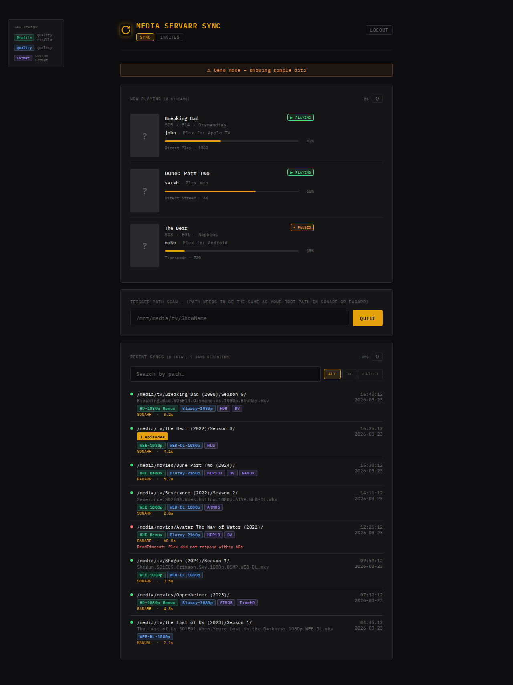

# Media Servarr Sync

> ⚠️ **AI-Generated Project** — This project was built with the assistance of [Claude AI](https://claude.ai) by Anthropic. Review all code before running it in your environment.

A lightweight webhook receiver that listens for **Sonarr** and **Radarr** events and triggers a targeted **partial Plex library scan** — no full library refreshes needed. Optionally integrates with **rclone VFS** to clear the cache before scanning (enable only if you use an rclone mount).

```
Sonarr / Radarr  →  media-servarr-sync  →  [rclone vfs/forget + vfs/refresh]  →  Plex partial scan
                                                  (optional, USE_RCLONE=true)
```

---

## Features

- **Targeted scans** — only the affected show/movie folder is scanned, not the whole library
- **rclone optional** — works standalone without rclone; enable with `USE_RCLONE=true` if you use a VFS mount
- **Deduplication** — duplicate webhooks for the same folder are dropped while a sync is already in-flight
- **Configurable delay** — wait N seconds after the webhook before scanning (gives Sonarr/Radarr time to finish writing)
- **Minimum file age** — optionally hold off scanning until a file is at least N seconds old
- **Retry on timeout** — Plex scan attempts retry up to 3 times with automatic reconnection on stale sessions
- **Health endpoint** — `/health` exposes queue depth, Plex connectivity, rclone mode, and recent sync history
- **Manual trigger UI** — password-protected web UI at `/webhook/manual` for ad-hoc scans
- **Sync history** — last 50 sync results (path, status, duration, errors) visible in the UI and health endpoint

---

## **📷Screenshots**

* **WebUI**


## Quick Start

### 1. Clone

```bash
git clone https://github.com/youruser/media-servarr-sync.git
cd media-servarr-sync
```

### 2. Configure

```bash
cp .env.example .env
# Edit .env with your values
```

### 3. Run

```bash
docker compose up -d
```

---

## Configuration

All configuration is done via environment variables (or a `.env` file in the project root).

### Core settings

| Variable | Required | Default | Description |
|---|---|---|---|
| `PLEX_URL` | ✔️  | `http://127.0.0.1:32400` | URL of your Plex Media Server |
| `PLEX_TOKEN` | ✔️  | — | Your Plex authentication token ([how to find it](https://support.plex.tv/articles/204059436)) |
| `PLEX_TIMEOUT` | | `60` | Plex API call timeout. Accepts same duration format as `WEBHOOK_DELAY` e.g. `60`, `2m` |
| `PLEXAPI_HEADER_IDENTIFIER` | | `media-servarr-sync` | Stable client identifier sent to Plex — prevents a new device being registered on every container restart |
| `TZ` | | `UTC` | IANA timezone for log timestamps and sync history, e.g. `America/New_York`, `Europe/London` |
| `PORT` | | `5000` | Port the webhook receiver listens on |
| `WEBHOOK_DELAY` | | `30` | Time to wait after receiving a webhook before acting. Accepts `30`, `30s`, `5m`, `1h` |
| `MINIMUM_AGE` | | `0` | Minimum file age before scanning. Same format as `WEBHOOK_DELAY`. `0` disables |
| `HISTORY_DAYS` | | `7` | Number of days to retain sync history. Older entries are auto-deleted. |
| `SECTION_MAPPING` | ✔️  | `{}` | JSON map of path prefixes → Plex library section IDs |
| `PATH_REPLACEMENTS` | | `{}` | JSON map: Sonarr/Radarr path prefix → path as seen inside this container |
| `MANUAL_USER` | | `admin` | Username for the manual trigger UI |
| `MANUAL_PASS` | | `changeme` | Password for the manual trigger UI |
| `SECRET_KEY` | ✔️  | random | Secret used to sign session cookies. Generate with `python3 -c "import secrets; print(secrets.token_hex(32))"` |
| `MEDIA_ROOT` | | `/mnt/media` | Host path mounted read-only for age checks (only needed if `MINIMUM_AGE > 0`) |

### Rclone settings

Set `USE_RCLONE=true` **only** if you serve your media through an rclone VFS mount. If you use a direct disk, NFS, MergerFS, or any non-rclone mount, leave this `false` and ignore all other `RCLONE_*` variables.

| Variable | Required | Default | Description |
|---|---|---|---|
| `USE_RCLONE` | | `false` | Enable rclone VFS cache clearing before each scan |
| `RCLONE_RC_URL` | if rclone | — | rclone RC endpoint, e.g. `http://rclone:5572` |
| `RCLONE_RC_USER` | | — | rclone RC username (if auth is enabled) |
| `RCLONE_RC_PASS` | | — | rclone RC password (if auth is enabled) |
| `RCLONE_MOUNT_ROOT` | | — | Absolute path of the rclone mount root, e.g. `/mnt/media` |
| `RCLONE_PATH_REPLACEMENTS` | | `{}` | JSON map: Sonarr/Radarr path prefix → rclone host path |

### Duration format

`WEBHOOK_DELAY` and `MINIMUM_AGE` accept:

| Format | Meaning |
|---|---|
| `30` or `30s` | 30 seconds |
| `5m` | 5 minutes |
| `1h` | 1 hour |
| `1d` | 1 day |

### Path mappings

These are JSON objects mapping path **prefixes**. Matching is case-insensitive and longest-prefix wins.

**`PATH_REPLACEMENTS`** — translates paths from how Sonarr/Radarr report them to how they appear *inside the media-servarr-sync container* (and therefore inside Plex):

```env
PATH_REPLACEMENTS={ "/data/tv": "/mnt/media/tv", "/data/movies": "/mnt/media/movies" }
```

**`RCLONE_PATH_REPLACEMENTS`** — only needed when `USE_RCLONE=true`. Translates paths to the form needed for the rclone RC call:

```env
RCLONE_PATH_REPLACEMENTS={ "/data/tv": "/mnt/media/tv" }
```

**`SECTION_MAPPING`** — maps a path prefix to a Plex library section ID. To find your section IDs, visit:

```
http://YOUR_PLEX_IP:32400/library/sections?X-Plex-Token=YOUR_TOKEN
```

```env
SECTION_MAPPING={ "/mnt/media/tv": "1", "/mnt/media/movies": "2" }
```

---

## Webhook Setup

### Sonarr

1. Go to **Settings → Connect → + (Add Connection) → Webhook**
2. Set the URL to: `http://media-servarr-sync:5000/webhook/sonarr`
3. Enable events: **On Import**, **On Upgrade**

### Radarr

1. Go to **Settings → Connect → + (Add Connection) → Webhook**
2. Set the URL to: `http://media-servarr-sync:5000/webhook/radarr`
3. Enable events: **On Import**, **On Upgrade**

---

## Endpoints

| Endpoint | Method | Auth | Description |
|---|---|---|---|
| `/webhook/sonarr` | POST | None | Sonarr webhook receiver |
| `/webhook/radarr` | POST | None | Radarr webhook receiver |
| `/webhook/manual` | GET / POST | Basic | Manual sync trigger UI |
| `/health` | GET | None | JSON health + recent history |

### Health response example

```json
{
  "status": "ok",
  "plex_connected": true,
  "rclone_enabled": false,
  "queue_depth": 0,
  "worker_alive": true,
  "recent_history": [
    {
      "ts": "2025-01-15T21:04:33+00:00",
      "label": "SONARR",
      "path": "/mnt/media/tv/Breaking Bad/",
      "status": "ok",
      "error": "",
      "duration_s": 43.2
    }
  ]
}
```

---

## Common setups

### Direct disk / MergerFS / NFS (no rclone)

```env
USE_RCLONE=false
PLEX_URL=http://192.168.1.100:32400
PLEX_TOKEN=xxxx
SECTION_MAPPING={ "/mnt/media/tv": "1", "/mnt/media/movies": "2" }
```

Sonarr and Plex share the same paths inside Docker — no `PATH_REPLACEMENTS` needed.

### rclone VFS mount

```env
USE_RCLONE=true
RCLONE_RC_URL=http://rclone:5572
RCLONE_MOUNT_ROOT=/mnt/media
PATH_REPLACEMENTS={ "/data/tv": "/mnt/media/tv" }
RCLONE_PATH_REPLACEMENTS={ "/data/tv": "/mnt/media/tv" }
SECTION_MAPPING={ "/mnt/media/tv": "1" }
```

---

## Docker Compose (full stack with rclone on shared network)

```yaml
networks:
  media:
    external: true

services:
  media-servarr-sync:
    image: media-servarr-sync:latest
    networks:
      - media
    environment:
      USE_RCLONE: "true"
      RCLONE_RC_URL: http://rclone:5572
      # ... other vars
```

---

## Building locally

```bash
docker build -t media-servarr-sync .
```

---

## License

MIT
